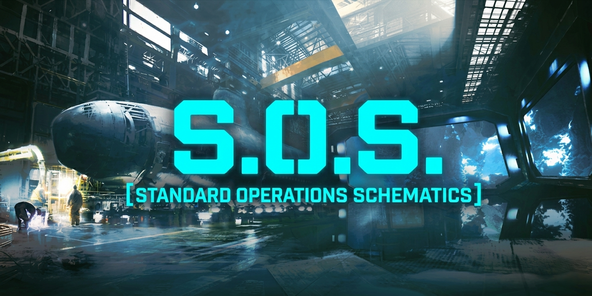

# S.O.S. - Standard Operations Schematics

---

---

**S.O.S.** is a high-performance recipe browser and object tracking utility for **Barotrauma**. Designed to be the ultimate companion for both vanilla and heavily modded campaigns, it provides a seamless, integrated interface to explore the complex system of Europa.

## Key Features

- **Comprehensive Browser:** View Fabrication, Deconstruction, and "Used In" recipes for any object in the game.
- **Affliction Browser:** Browse detailed information of ALL afflictions (Status Effects), including modded ones. View their effects, treatments, contraindications, and more — just like items.
- **Clinical Simulator:** Open the SIMULATOR tab to test afflictions and treatments on a dummy patient. Add or remove afflictions, adjust their strength, and apply items to preview real-time effects — without consuming resources or risking your crew.
- **UPDATED:** **HUD Tracker:** Track fabrication recipes in real-time with an on-screen checklist. Supports per-recipe tracking — items with multiple recipes show a submenu to pick which to track. Use Ctrl+[SOSKey] or the Show/Hide button to toggle visibility.
- **Dynamic Meta-Info:** View base prices, object tags, stack sizes, and detailed descriptions in a structured Wiki-style panel.
- **Detailed Recipe Analytics:** Refined "Obtain" and "Usage" sections with context-aware filtering and smart ingredient wrapping.
- **Smart List Filters:** Click on the separator bars (Items, Afflictions, etc.) in the results list to instantly filter by that object type.
- **Responsive UI:** High-precision resizable interface that ensures the UI is always displayed in any position, scale or aspect ratio you want, as a real window.
- **Favorites & History:** Web-browser style navigation (Back/Forward) and a pinning system for quick access to frequent items.
- **Multi-language Support:** Native support for English, Spanish, Russian, French, and Chinese. (Last 3 are translated by AI, if anyone wants to correct them, are free to make a pull request and help us.)
- **NEW:** **Configurable Settings:** SOS open key, tracker visibility, XML font scale, and window position are configurable directly from the LuaCs in-game settings menu for convenience or if you encounter any issues.

## Controls

### General

- **[J]**: Open / Close the SOS Menu. When used over an item (on inventories, recipe in crafting menu, and any item in shop), it will open the SOS Menu with the item the mouse is hovering over.
- **[Shift + J]**: Open / Close the SOS Menu with the world object (light, deconstructor, walls, items in world, etc) the mouse is hovering over.
- **[Ctrl + J]**: Toggle recipe tracker visibility on the HUD.
- **[Alt + Left Arrow], [Backspace]** or **[Mouse 4]**: Navigate to previous item.
- **[Alt + Right Arrow], [Shift + Backspace]** or **[Mouse 5]**: Navigate to next item.
- **[Left Click]**: Select item / Navigate to ingredient.
- **[Right Click]**: Open context menu (Track item, Toggle Favorite, etc.).
- **[Escape]**: Close window.

### Window

- **[Drag Title Bar]**: Move the window.
- **[Drag Borders or Corners]**: Resize the window.
- **[Ctrl + Drag Borders or Corners]**: Resize the window with a parallel aspect ratio.
- **[Shift + Drag Borders or Corners]**: Move the window.

### In XML View

- **[Mouse Wheel]**: Move Vertically
- **[Shift + Mouse Wheel]**: Move Horizontally
- **[Ctrl + Mouse Wheel]**: Apply Zoom

### Search Tab

Search by Name, ID, Category, Tags, ModName, ItemType, and other filters.

Advanced Filters:

| Filter      | Description     | Example             |
|-------------|-----------------|---------------------|
| `@Mod`      | Mod Name        | `@Vanilla @Neuro`   |
| `#Category` | Category        | `#Medical #Weapon`  |
| `$Tag`      | Tag             | `$smallitem $pill`  |
| `&Slot`     | Slot            | `&Head &Inner`      |
| `!ID`       | Item ID         | `!weldingtool`      |
| `%Type`     | Class Type Name | `%Item %Affliction %TalentPrefab` |

**Example:** `Brain @NT #Medical $surgery %Item`

## Project Status: Beta

**S.O.S.** is currently in its Beta stage. While the core functionality is stable and high-performing, we are working towards deep integration with the game's mechanics and immersion.

*Stay tuned for these updates as we move toward the 1.0 Full Release.*

---

## Common questions

**Q:** *Can it be used on vanilla servers?*

- **A:** Absolutely, this is a client-side mod, so it only matters for you — it doesn't affect any other player or server you play on.

**Q:** *Is it compatible with all mods?*

- **A:** At the moment, yes. It should be compatible with ALL content mods. If you encounter any error or bug with other mods, please report them on GitHub or the Steam page.

**Q:** *Is it really compatible with ALL in-game items?*

- **A:** *Yes! Everything, including submarine parts and items from mods. I've decided not to exclude these items for now, as they contain descriptions and other useful metadata. If they bother you, you can create an issue on the GitHub project, leave a comment on the Steam page, or contact me directly, and I'll prioritize it.*

## License & Copyright

This project is licensed under the **GNU General Public License v3.0 (GPLv3)**.  
See the [LICENSE](LICENCE) file in the project root for the full text of the license.

### Key Terms

- **Freedom to Use and Modify** — You may use, study, modify, and run this software for any purpose, both privately and publicly.
- **Attribution Required** — Any redistribution or publication of this project or its derivatives must retain the original copyright notice and clearly credit the author (**[@Retype15](https://github.com/Retype15)**).
- **Copyleft Protection** — Any modified version that is distributed must also be licensed under **GPLv3**, ensuring that all derivatives remain free and open.
- **Source Availability** — If you distribute a modified version, you must also provide access to the corresponding source code under the same license terms.

---

*Github Project: [SOS](https://github.com/Retype15/SOS)*
*Developed by [@Retype15](https://github.com/Retype15)*

    
